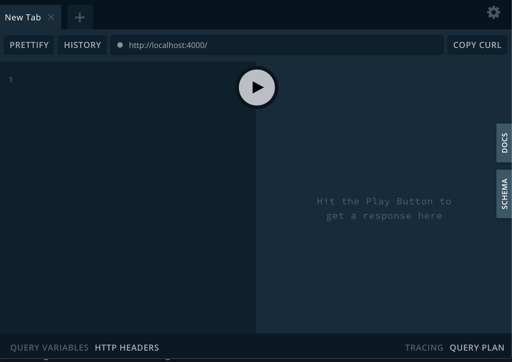

# gql-mongodb
## Example on using GraphQL with native MongoDB Node.js driver

This is an example Apollo Server using GraphQL.  Built using the
native MongoDB Node.js driver.

## Prerequisites
* node.js
* npm
* Local running instance of MongoDB (if using Atlas, will require a URL modification)
* Create database 'sample_mflix' and collection 'movies'
* Import the JSON file contained in the data/ directory to sample_mflix.movies

## Steps to Run Example
### Clone this repository 

```
git clone https://github.com/blainemincey/gql-mongodb.git
```

### Change directory into the root directory and install dependencies
```
npm install
```

### Run the application.  Be sure MongoDB is already running!
```
node index.js
```
### You will see a 'Server Ready' message similar to that below:
```
❯ node index.js                                                                                                                                                                      15:46:57   05/04/20 
🚀  Server ready at http://localhost:4000/
MongoDB connected.
```

### Open a browser to http://localhost:4000.  This opens the Apollo Playground and should look similar to that below: 


### Run sample queries
#### Smoketest
Paste the following in the left-hand window in the Playground:
```
{
  smoketest
}
``` 
Click the 'arrow' button in the center of the Playground.  If we are running successfully, you will see a return message with the current timestamp:
```
{
  "data": {
    "smoketest": "Successful smoke test at Mon May 04 2020 15:57:57 GMT-0400 (Eastern Daylight Time)!"
  }
}
``` 

#### Query for movies
Paste the following in the left-hand window to query for all movies:
```
{
  movies {
    _id
    plot
    genres
    runtime
    cast
    num_mflix_comments
    title
    rated
    directors
    year
    countries
    imdb {
      rating
    }
  }
}
```

Click the arrow button in the center and you should receive a listing of 50 movies.  There
is a limit of 50 within the index.js file that you can modify.

With GraphQL, you can 'select' what fields you want returned.  Try to remove a few fields
from this query and try again.

#### Query for a specific movie
Paste the following query in the left-hand window of the Playground.  This will
filter for a movie titled 'The Matrix'.  Only an exact match on the title field is currently
supported.

```
{
  movie (title:"The Matrix") {
    _id
    plot
    genres
    runtime
    cast
    num_mflix_comments
    title
    rated
    directors
    year
    countries
    imdb {
      rating
    }
  }
}
```

#### Postman
Within the Apollo Playground, if you click the far-right option 'Schema', you can copy the 
contents of this file and paste to within Postman.  This will automatically create the
same 3 queries above within Postman on your behalf.  All you will be required to do is
to ensure the correct 'url' property has the correct value.

